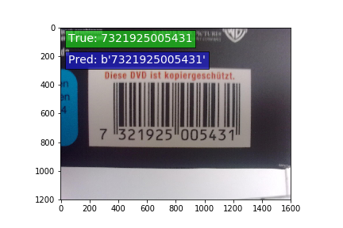
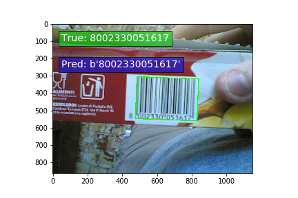

# Robust Barcode Decoder

_Francisco Gonzalez_

Localizes, extracts, and decodes barcodes from non-autofocus images.

 
Figure 1. Autofocus barcode image.

 
Figure 2. Non-autofocus barcode image.

